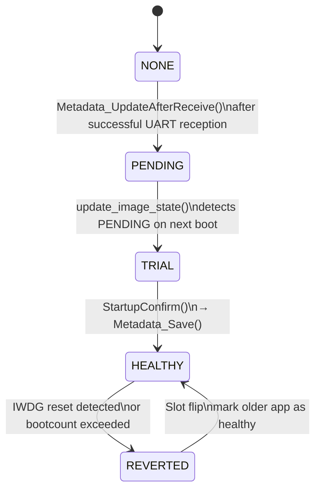

# stmboot: an attempt at a secure bootloader for STM32 MCUs

A lightweight, hardware-agnostic secure bootloader for STM32 microcontrollers featuring dual-slot A/B firmware updates, cryptographic verification, AES-128 encryption.

> As of now I have only implemented the PAL layers on STM32F103RB therefore all the testing ONLY been conducted on F1 (later versions may include native support for other MCUs although the architecture has been planned as to keep the bootloader hardware agnostic to the STM32 family).

## Current State
### Release Build
| Memory Region  | Used Size | Region Size | Usage % |
|----------------|-----------|--------------|---------|
| RAM            | 3136 B   | 20 KB        |   15.31%  |   
| FLASH          |  13688 B  | 24 KB        |   55.70%  |

## Rational:
Although other more sophisticated BLs exist it is of my understanding that using them without Zephyr is moderate to high effort. While they are usually OS-agnostic, Zephyr provides built-in tools (like Kconfig and partition management) that handle much of the heavy lifting. Without these, you must manually implement the underlying hardware and software requirements. **I aim to remove that porting effort for STM32 MCUs.**

In addition, these heavy duty BLs typically take a little over 32 kB of flash memory depending on hardware, feature configurations, and chosen cryptographic libraries. **I also aim to keep mine lightweight (under 24 kB)** :) .

---

## Table of Contents
- [Overview](#overview)
- [Planned Updates](#tbd-features)
- [Architecture](#architecture)
- [Memory Layout](#memory-layout)
- [Dual-Slot A/B Update Scheme](#dual-slot-ab-update-scheme)
- [UART Firmware Update Protocol](#uart-firmware-update-protocol)
  - [Packet Structure](#packet-structure)
  - [Handshake Sequence](#handshake-sequence)
  - [Python Tool Usage](#python-tool-usage)
  - [Image Preparation Pipeline](#image-preparation-pipeline)
- [Security](#security)
  - [ECDSA P-256 Signature Verification](#ecdsa-p-256-signature-verification)
  - [AES-128 CTR Encryption](#aes-128-ctr-encryption)
  - [Hardware CRC32](#hardware-crc32)
  - [Rollback Protection](#rollback-protection)
  - [Power Loss Resistance](#power-loss-resistance)
  - [Metadata Struct](#metadata-struct)
  - [Deterministic Metadata Image State Machine](#deterministic-metadata-image-state-state-machine)
- [Logging](#logging)
- [Bootloader Flow](#bootloader-flow)
- [Zephyr](#zephyr)
- [Testing](#testing)
- [Third-Party Libraries](#third-party-libraries)
---

## Overview

stmboot is a 24KB bootloader that sits at the start of STM32 flash memory. Moreover, it is an educational project and aims to provide minimal secure boot. 

| Property | Value |
|----------|-------|
| Bootloader size | 24KB |
| Slot size | 48KB each |
| Update transport | UART at 115200 baud |
| Signature algorithm | ECDSA P-256 over SHA-256 |
| Encryption | AES-128 CTR with random IV per update |
| Integrity check | STM32 hardware CRC32 + Dual metadata slots with CRC check |
| Rollback protection | Boot counter + firmware version check |
| Power loss resistance | Power loss handling while writing/erasing flash and during fw update |

---

## TBD Features
in order of priority:
### Housekeeping:
1. Test IWDG
1. Power loss: Make Python/BL script resume restart when possible
1. Verify signature before booting !! (Added commented code, currently leads to Hard_Fault)
1. Make modules build time configurable: CRC, AES, SHA256/EDCSA (Curve Selection) in Zephyr + no Zephyr
1. Github Actions/Testing:
  - Feature unit tests GTest
  - Integration testing
  - Security testing
  - Performance measurements: Boottime, verification time, update time/fw size, flash footprint, RAM footprint, flash wear resistance/levelling
  - Static tests: cpp-check, clang-tidy
### Features:
1. USB FWU path: dfu-util host and dfu protocol
1. Security:
  - Cryptographic ownership transfer by rotating root keys - Public Key Infrastructure
  - Immutable Trust Chain
    - Two-stage boot (OEMiRoT + uRoT equivalent)
    - Bootloader self-update (wolfBoot equivalent)
  - Documentation update/Literature standards 4 report: NIST recommendations, IEC 62443, ETSI IoT security recommendations
1. Constant-time comparison for signature/CRC verification. avoid early-exit byte comparisons that leak timing information
1. Secure erase of sensitive RAM after use: zero out AES key context, decrypted chunks, and IV material after each update completes
1. PVD brownout check: use the STM32's Programmable Voltage Detector to defer flash writes when voltage is already sagging
### Extensions:
1. Zephyr Sysbuild
1. Shell
1. Settings/Meta KV store
1. Diagnostics at boot (ram integrity check, peripheral detection, flash wear?) 
  - Diagnostics recorded into protected memory after failure
1. Rollback: Delta History
1. Self-Documenting Hardware
  - @ boot, the device exposes itself as a USB drive containing schematics, datasheets, API docs, service manuals
1. ESP32 OTA update path -> UART (espIDF mbedTLS)

## Architecture

stmboot separates concerns into four distinct layers. bootutil and boot logic never include HAL headers directly and all hardware access goes through the Platform Abstraction Layer (PAL). Adding support for a new STM32 family requires only a new `platform/stm32/<family>/` folder and a new board entry in CMake.

```
stmboot/
┌─────────────────────────────────────────────────┐
│                  boot/                          │
│   main.c — Rollback, update image state,        │
│   check for updates, jump to application        │
│   logging.h - no logging, uart logging,         │
│   printf-stdarg.c logging                       │
├─────────────────────────────────────────────────┤
│                  cmake/                         │
|   boards/ - contains corresponding PAL          │
│              & drivers for boards               │
|   gcc-arm-none-eabi.cmake                       |
├─────────────────────────────────────────────────┤
│           bootutil/ (PAL calls only)            │
│        crypto/          │       fwupdate/       │
| aes_ctr - has AES key   │    metadata.c         │
| ECDSA P-256 public key  │    uart_reception.c   │
| verify.c - uECC checks  │                       │
|            SHA256 digest│                       │
├─────────────────────────────────────────────────┤
│              platform/pal/                      │
│  pal_uart.h  pal_flash.h  pal_gpio.h            │
│  pal_dma.h   pal_time.h   pal_crc.h             │
│  pal_iwdg.h                                     │
├──────────────┬──────────────┬───────────────────┤
│ stm32/f1/pal │ stm32/g4/pal │ stm32/h7/pal      │
│ (HAL calls)  │ (stub)       │ (stub)            │
├──────────────┴──────────────┴───────────────────┤
│  platform/bsp/<board>/  board_config.h pinmap.h │
├─────────────────────────────────────────────────┤
│              third_party/                       │
│  stm32_hal/  CMSIS/  aes/  sha256/  uECC/       │
└─────────────────────────────────────────────────┘
```

---

## Memory Layout
```
STM32F103RB — 128KB Flash
─────────────────────────────────────────────────────
0x08000000  ┌─────────────────────────────────────┐
            │         Bootloader (24KB)           │
0x08006000  ├─────────────────────────────────────┤
            │           Slot A  (48KB)            │
            │        Primary application slot     │
0x08012000  ├─────────────────────────────────────┤
            │           Slot B  (48KB)            │
            │        Secondary application slot   │
0x0801E000  ├─────────────────────────────────────┤
            │         Metadata  (8KB)              │
0x0801F000  │  Dual-copy: magic, state, version,   │
            │  boot counter, IV, CRC, sequence     │
0x08020000  └─────────────────────────────────────┘
```

---

## Dual-Slot A/B Update Scheme

```
First update:
  SLOTA_LATEST = 1  →  receive into Slot B  →  flip to SLOTA_LATEST = 0
  Boot from Slot B

Second update:
  SLOTA_LATEST = 0  →  receive into Slot A  →  flip to SLOTA_LATEST = 1
  Boot from Slot A
```

**Rollback:** if the new firmware exceeds `BOOT_COUNT_MAX` or `RUNTIME_BOOT_COUNT_MAX` (triggered by consecutive boots without `StartupConfirm()`), the bootloader flips `SLOTA_LATEST` back and boots the previous slot. The previous slot's firmware is not overwritten until a successful update confirms the new image.

---

## UART Firmware Update Protocol

Update mode is entered by pressing the User Button (B1) within 5 seconds of reset. The Python tool (`scripts/send_test_ab.py`) drives the protocol.

### Packet structure

```
┌────────┬────────┬──────────┬──────────┬───────────────────┬───────────────────┐────────────────────┐
│ 0xAA   │ 0xBB   │ FW_MAJOR │ FW_MINOR │ Random IV         | DATA (N bytes)    │ CRC32 (4 bytes LE) │
│ 1 byte │ 1 byte │ 1 byte   │ 1 byte   │ 16 bytes          | encrypted+signed  │ over signed plain  │
└────────┴────────┴──────────┴──────────┴───────────────────┴───────────────────┘────────────────────┘
```
> The bootloader uses the Random IV to initialise AES-128 CTR decryption.

### Handshake sequence

```
MCU                              Python
 │                                  │
 │──── "READY\r\n" ────────────────►│  MCU enters update mode
 │                                  │
 │◄─── [0xAA 0xBB MAJOR MINOR] ─────│  Python sends 4-byte header
 │                                  │
 │──── "A\r\n" or "B\r\n" ─────────►│  MCU reports which slot it will program
 │──── "ACK\r\n" ──────────────────►│  header accepted, version approved
 │                                  │
 │◄─── IV [16 bytes] ───────────────│  random IV for AES-128 CTR
 │──── "ACK\r\n"─ ─────────────────►│
 │                                  │
 │◄─── SIZE [4 bytes LE] ───────────│  total firmware size
 │──── "ACK\r\n"─ ─────────────────►│
 │                                  │
 │◄─── CHUNK [1024 bytes] ──────────│  ─┐
 │  decrypt → CRC accumulate        │   │  repeated until all
 │  → write to flash                │   │  data transferred
 │──── "ACK\r\n"─ ─────────────────►│  ─┘
 │                                  │
 │──── "ACK\r\n" ──────────────────►│  all chunks received
 │                                  │
 │◄─── CRC [4 bytes LE] ────────────│  CRC32 over signed plaintext
 │  verify CRC                      │
 │  verify ECDSA signature          │
 │──── "ACK\r\n" ──────────────────►│  CRC + signature verified
 │                                  │
 │──── "OK\r\n" ───────────────────►│  update complete, rebooting
```

### Python tool usage
From the root directory:
```bash
sh upload.sh
```

### Image preparation pipeline

```
Application.bin
      │
      ▼  sign_firmware.py  (ECDSA P-256, appends 64-byte signature)
Application.signed.bin
      │
      ▼  encrypt_firmware.py  (AES-128 CTR, random IV)
Application.enc.bin
      │
      ▼  send_test_ab.py  (UART transfer with ACK/NACK handshake)
      │
      ▼  MCU: decrypt → CRC → ECDSA verify → flash write
```

---

## Security

### ECDSA P-256 Signature Verification

Every firmware image is signed before transmission. The bootloader verifies the signature using the embedded public key before writing anything to the active slot.

```
PC side:
  SHA-256(firmware) → ECDSA sign with private key → 64-byte signature
  Signature appended to end of firmware binary

MCU side (after decryption):
  SHA-256(firmware body) → ECDSA verify(public_key, hash, signature)
  Rejection: erase staging slot, return RECEP_ERR_SIG
```

- Curve: SECP256R1 (P-256)
- Hash: SHA-256
- Signature format: raw 64 bytes (32 r + 32 s, big-endian)
- Public key: baked into bootloader flash as `bootutil/crypto/public_key.h`
- Library: [micro-ecc](https://github.com/kmackay/micro-ecc) (~2KB flash)

### AES-128 CTR Encryption

Firmware is encrypted in transit. The bootloader decrypts each 1KB chunk on the fly before CRC accumulation and flash write — plaintext never accumulates in RAM.

```
Key:  16-byte shared secret, compiled into bootloader (AES_KEY in aes_ctr.h)
IV:   16-byte random value generated per upload (os.urandom(16))
      sent unencrypted as first 16 bytes of packet
Mode: CTR — streamable, no padding required, encrypt = decrypt
```

- Library: [tiny-AES-c](https://github.com/kokke/tiny-AES-c)
- Key size: 128-bit
- IV: random per update — prevents keystream reuse attacks

### Hardware CRC32

CRC is computed over the signed plaintext (after decryption) using the STM32 hardware CRC peripheral. The Python tool computes the same CRC before encryption and sends it as the packet trailer.

```
Polynomial:  0x04C11DB7  (STM32 hardware default)
Initial:     0xFFFFFFFF
Input:       32-bit words, MSB first
Padding:     data padded to 4-byte boundary with 0xFF
```


### Rollback Protection

**Boot counter:** The bootloader increments `metadata.bootcount` on every boot in `IMG_STATE_TRIAL`. If `bootcount > BOOT_COUNT_MAX` before the application calls `StartupConfirm()`, the bootloader rolls back to the previous slot.

**Version check:** Incoming firmware version (sent in header bytes 3–4) must be strictly greater than `metadata.FW_VER_MAJOR.FW_VER_MINOR`. Downgrades are rejected with `RECEP_ERR_VERSION`.

**IWDG runtime check:** If the application fails to pet the IWDG watchdog, the MCU resets. On next boot, `system_init.c` detects the IWDG reset flag in `RCC->CSR`. Each IWDG reset increments `metadata.runtime_fault_count`. If `runtime_fault_count > RUNTIME_FAULT_MAX`, rollback is triggered.

### Power Loss Resistance
Three primary cases exist:
1. Window 1 (power during erase/write in BL functions other the FW update):
  IDLE → ERASING/WRITING → [power lost]
    On next boot: detect ERASING/WRITING → re-erase → reset to IDLE
1. Window 2 (power during Metadata_Save):
  **Dual metadata slots:** Two copies of the `Metadata` struct are maintained with a monotonically increasing `sequence` counter. `Metadata_Save` always writes to the copy with the lower sequence number. `Metadata_Load` uses the copy with the higher sequence number that has a valid magic and CRC. One copy is always valid even if the write of the other is interrupted mid-erase.
1. Power loss during FW update:
  Cases handled in metadata states below. 
  send RESUME_RESTART to python (TODO)
---

### Metadata struct

```c
typedef enum {
    BL_STATE_IDLE = 0x0, // no writing in prog
    BL_STATE_ERASING = 0x1, // erase started not completed
    BL_STATE_WRITING = 0x2, // write started not completed
} BLState;

typedef enum {
    FWU_STATE_IDLE = 0x0,
    FWU_STATE_START = 0x1,
    FWU_STATE_ERASEDSLOT = 0x2,
    FWU_STATE_WRITECOMPLETE = 0x3,
    FWU_STATE_CRCVERIFIED = 0x4,
    FWU_STATE_ECCVERIFIED = 0x5,
} FWUState; 

// ... image state explained in detail in another section

typedef struct __attribute__((packed)) {
    uint32_t magic;
    uint32_t SLOTA_LATEST;
    uint32_t bootcount;
    uint8_t  FW_VER_MAJOR;
    uint8_t  FW_VER_MINOR;
    uint16_t _pad;
    uint32_t image_state;
    uint32_t runtime_fault_count;
    uint32_t sequence;
    uint8_t iv[16];
    uint32_t fw_size;
    uint32_t bl_state;
    uint32_t fwu_state;
    uint32_t crc; 
} Metadata;
```

#### Deterministic Metadata Image State State Machine
The `Metadata` struct persisted in flash drives a deterministic state machine. Every state has exactly one valid transition triggered by a specific observable event. No state has an undefined exit.

--- 

## Logging

Logging is compile-time configurable via `BL_LOG_LEVEL`. Set in `CMakeLists.txt` or `prj.conf`:

| Level | Value | Behaviour | Flash cost |
|-------|-------|-----------|-----------|
| `BL_LOG_NONE` | 0 | All log calls compiled out | 0 bytes |
| `BL_LOG_UART` | 1 | Raw `HAL_UART_Transmit` — fixed strings only | ~100 bytes |
| `BL_LOG_PRINTF` | 2 | Full `printf` via printf-stdarg.c | ~4KB |

`printf-stdarg.c`: Copyright 2001, 2002 Georges Menie (www.menie.org), stdarg version contributed by Christian Ettinger. Licensed under LGPL.

---

## Bootloader Flow
todo
```mermaid
todo
```

## Zephyr
- Currently STMBoot should be flashed seperately before using the app_zephyr. 
- app_zephyr can use the APIs defined in stmboot/zephyr/lib/stmboot_api.c
- Possible TODO to make it a sysbuild although this might void the RoT chain

---
## Testing
- Github Actions: Tests in GTest
  - File unit tests: Ceedling - CMock // still todo
  - Static tests: cppcheck, clang-tidy
---
## Third-Party Libraries

| Library | Version/Commit | Purpose | License |
|---------|---------------|---------|---------|
| [tiny-AES-c](https://github.com/kokke/tiny-AES-c) | Latest | AES-128 CTR encryption/decryption | Unlicense |
| [micro-ecc](https://github.com/kmackay/micro-ecc) | Latest | ECDSA P-256 signing and verification | BSD 2-Clause |
| [crypto-algorithms](https://github.com/B-Con/crypto-algorithms) | Latest | SHA-256 digest computation | Public Domain |
| [Ceedling](https://github.com/throwtheswitch/ceedling) | Latest | Unit testing and build system for C projectss | MIT License |
| printf-stdarg.c | — | Lightweight printf for embedded | LGPL — Copyright 2001, 2002 Georges Menie (www.menie.org), stdarg version contributed by Christian Ettinger |
| STM32F1xx HAL | CubeMX generated | STM32F1 peripheral drivers | BSD 3-Clause |
| CMSIS | ARM | Cortex-M3 core support | Apache 2.0 |

---